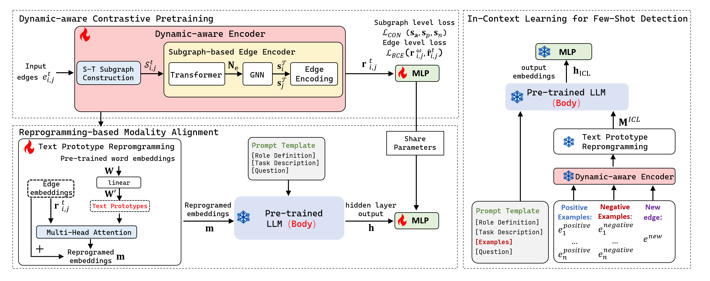

## Introduction
AnomalyLLM is a is a LLM enhanced few-shot anomaly detection framework. 

<p align="center">

</p>

- It consists of three key modules: (1)dynamic-aware encoder, (2)modality alignment and (3)in-context learning for detection. 

## Requirements
- networkx==3.2.1
- numpy==1.26.3
- PyYAML==6.0.1
- scikit-learn==1.4.0
- scipy==1.12.0
- torch==2.0.1
- torch_geometric==2.4.0
- torchaudio==2.0.2
- torchdata==0.7.1
- torchtext==0.17.0
- torchvision==0.15.2
- tqdm==4.66.1
- transformers==4.37.2
- urllib3==1.26.13

To install all dependencies:
```
pip install -r requirements.txt
```

## Quick Demos
1. Download backbone model and place them under `./backbone`
2. Tune the model. For example, you can evaluate on UCI Message datasets by:
```bash
python pre_training.py -dataset uci
```
```bash
python alignment.py -dataset uci
```
```bash
python evaluate.py -dataset uci
```